Inconsistency in Medical Annotations
===

Author
---

Shivam Dev Singh

email:-iamsinghshivam@gmail.com

Supervisor
---
Yesoda Bhargava

https://yesodabhargava.com/

Contributors
---

Yogesh Karan

Dhanashree Revagade

Aravind Unnikrishnan

Devasish Mahato

Disha Dudhal

**created and tested on Ubuntu 18.04 with Python 3.6**

An Attempt(which finally led us to the victory) to provide a solution to the company **ezDI** in the complicated type problem statement **Identify Inconsistency in Medical Annotations** in the **Smart India Hackathon(Software Edition) 2019**. This is a Web App developed in Django which displays the clusters of semantically similar medical terms having inconsistencies in Annotations. This project is based on strict dictionary lookup based approach.
Technologies used in this project:
	
	1. Django (Web Framework)
	2. QuickUMLS python module for looking into the UMLS
	3. UMLS for providing medical insights
	    (https://www.nlm.nih.gov/research/umls/licensedcontent/umlsknowledgesources.html)
**Input to the application:-** .tsv file containing sentences and their annotations

**Output of the application:-** .tsv file containing medical groups with their annotation patterns (apart from the web App)

Features provided in the Web App:

	1. Clusters with unique annotation patterns are displayed 
      (in order such that clusters with maximum inconsistency are shown first)
	2. On Clicking a particular pattern of a cluster,  sentences containing that pattern are shown.
	3. Search operations are also enabled so that one can search for occurence of 
        a particular word in the provided dataset or a particular annotation tag
	4. Statistical Insights are also provided which displays the proportion of inconsistency 
        in the data or contribution of multi-word entities vs single word entities in the inconsistencies
Front Page of the Web App
---
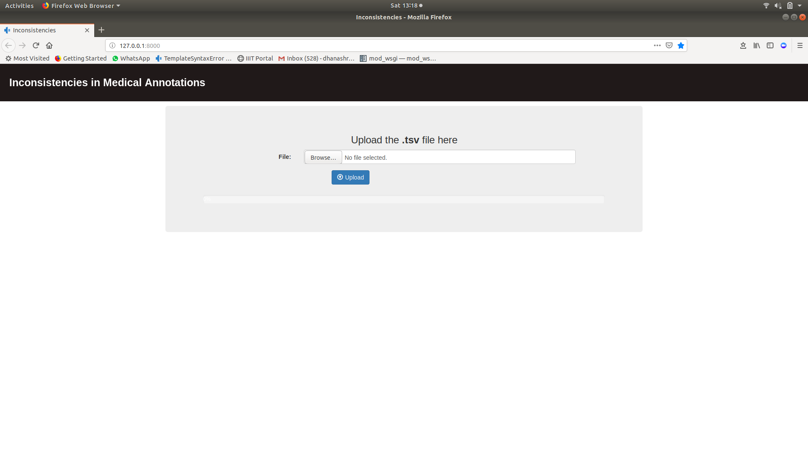

On Uploading a .tsv file
---
Uploading will take time as in this step preprocessing and clustering is done!

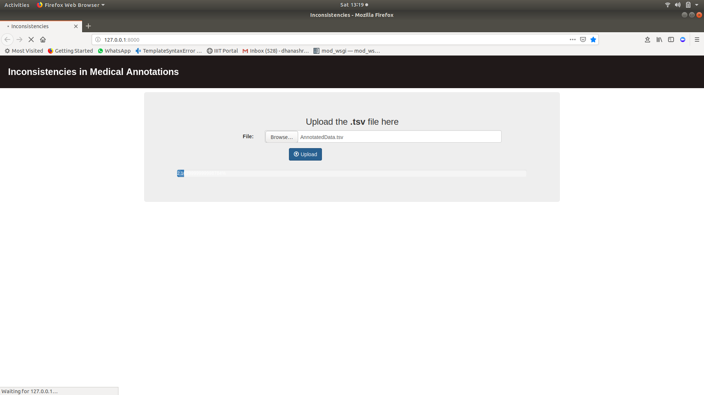

Home Page of the Web App
---
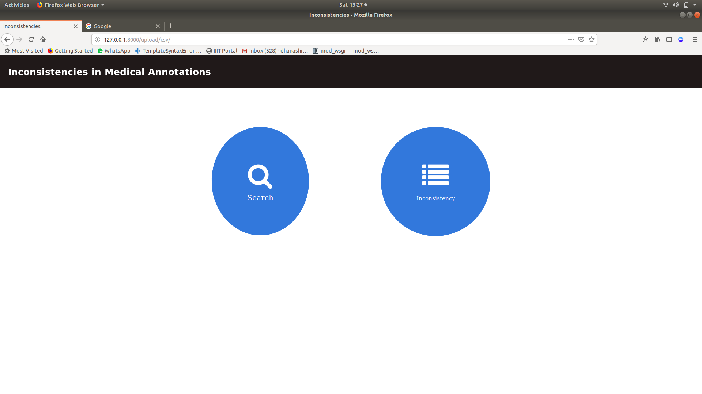

Search Page
---
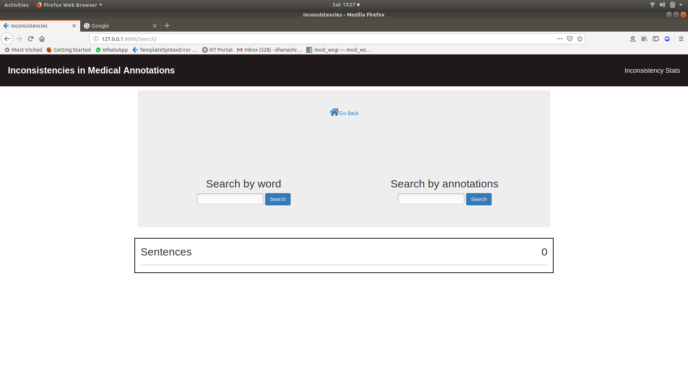

On searching a word
---
Here, sentences containing blood are displayed

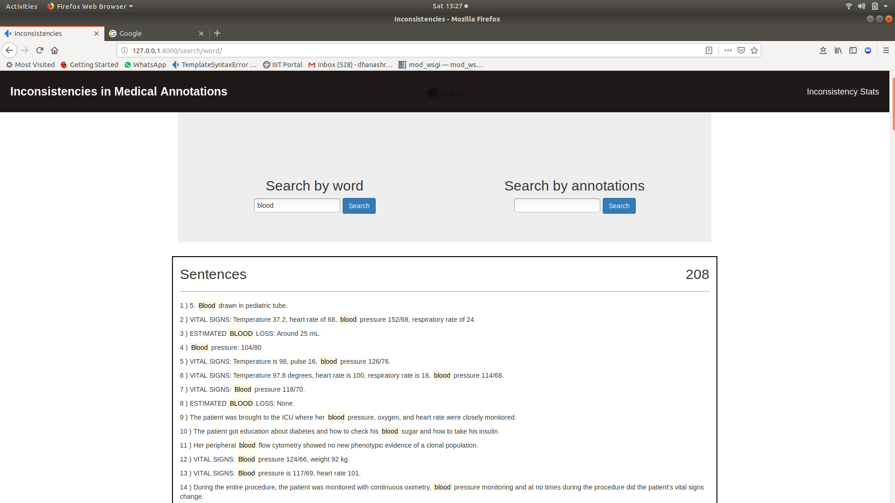

On searching a tag
---
Here, sentences with problematic temrs are displayed

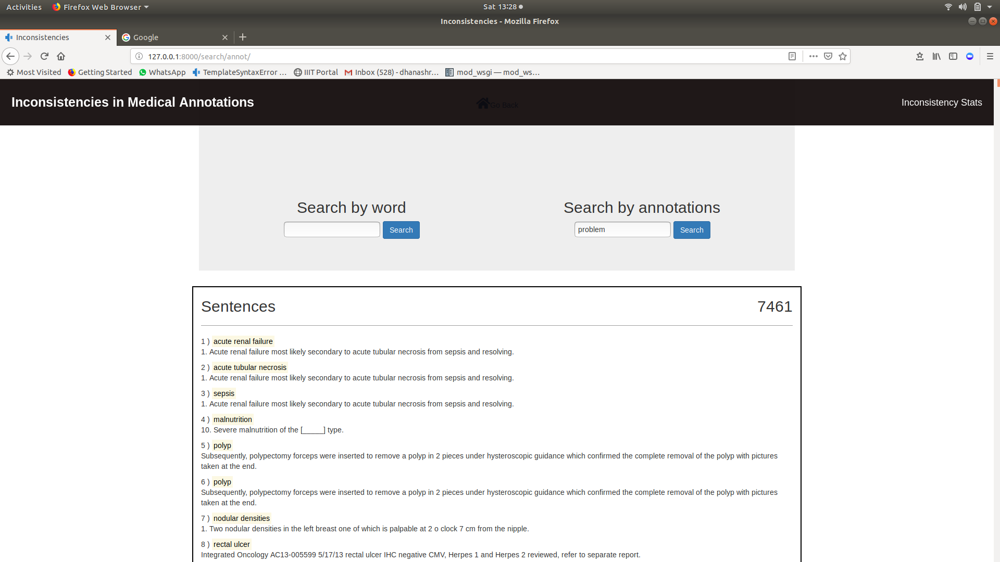

On searching a part of a word
---
Even on searching a part of a word, sentences are displayed

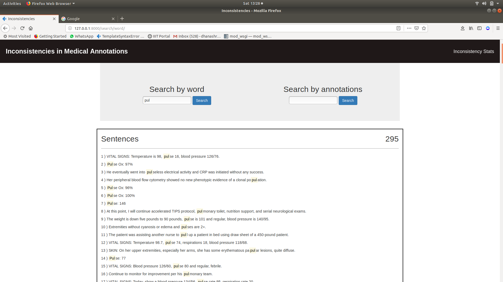

The Clusters with Unique Annotation Patterns
---
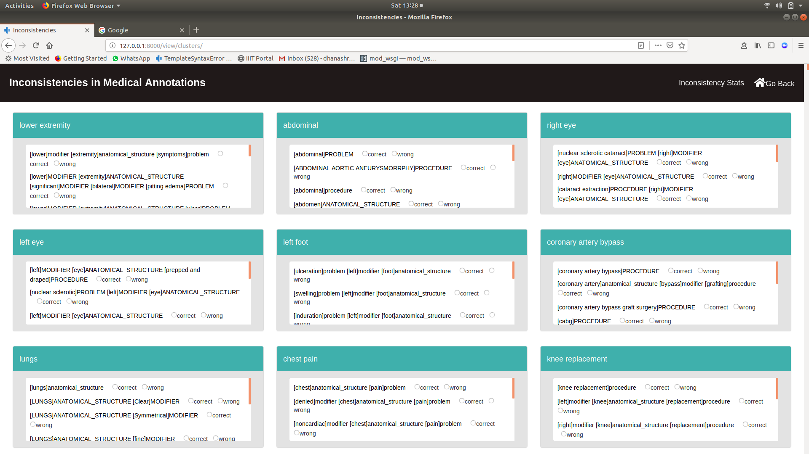

On clicking a pattern sentences containing that annotation pattern are displayed
---
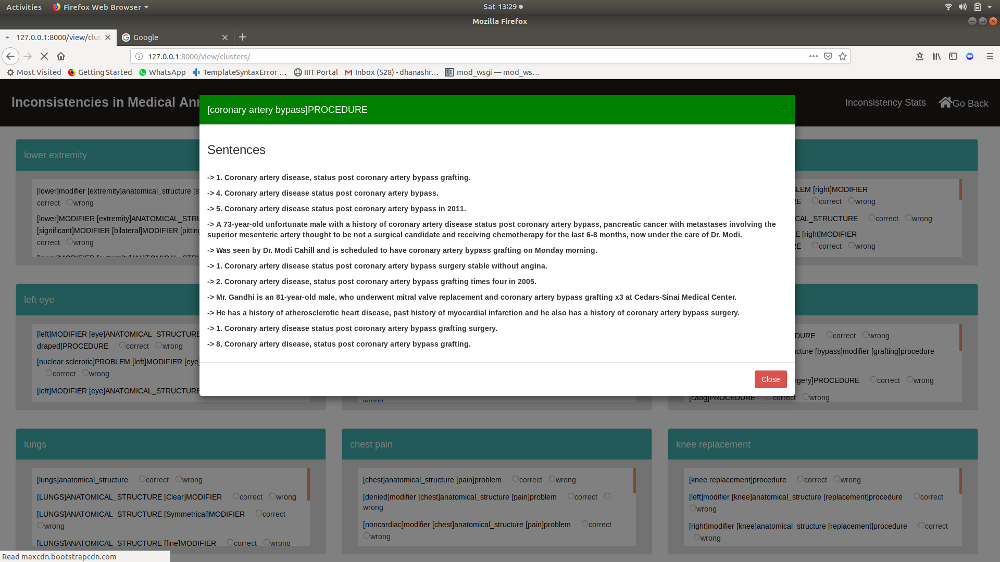

Inconsistency vs Consistency
---
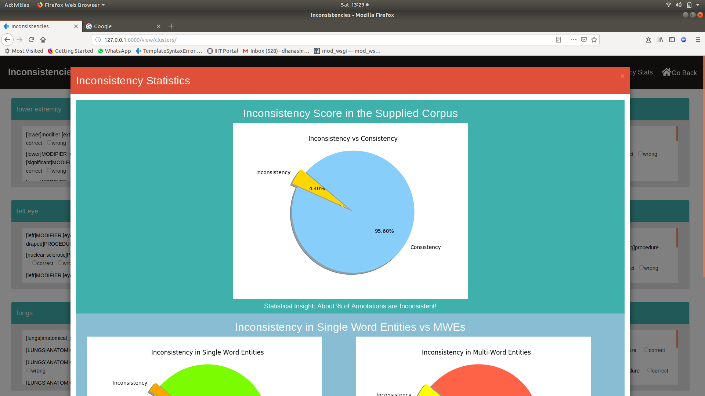

Inconsistency in Single Word Entities vs Multi Word Entities
---
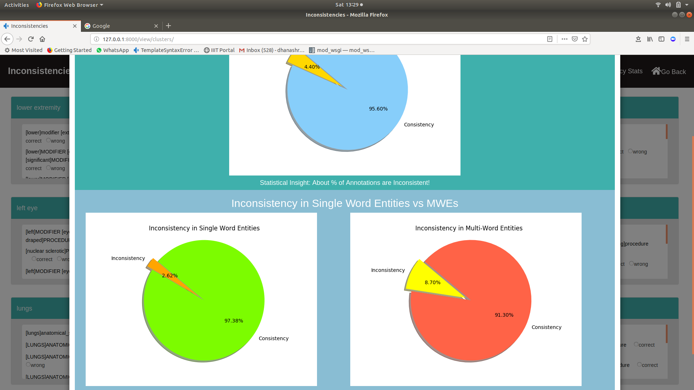

Few Words to Visitors
---

This Application is in its development phase and its obvious to get erroneous cluster patterns in some cases. A lot of improvement is needed.
Pull requests for any such changes are accepted. Feel free to fork this project and make your own changes too.

Thank you for Visiting!
